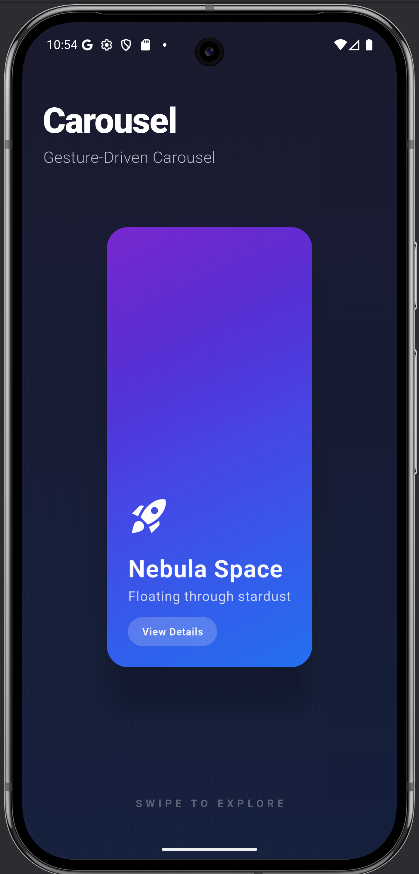
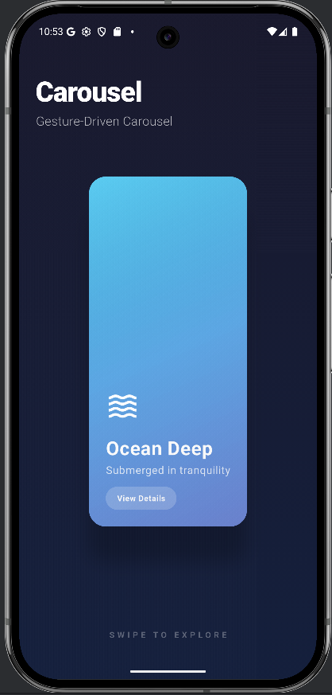
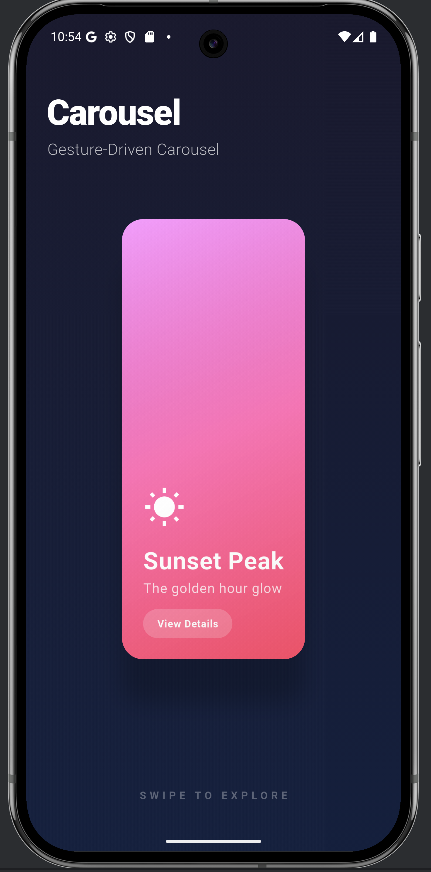

# Carousel

**A custom gesture-driven Flutter carousel featuring 3D perspective tilts, floating animations, and smooth parallax effects.**

## Preview

| Nebula Space | Ocean Deep | Sunset Peak |
| :---: | :---: | :---: |
|  |  |  |

## How to Run
1. Ensure you have Flutter installed.
2. Clone this repository.
3. Run the following commands in the project root:
   ```bash
   flutter pub get
   flutter run
   ```

## Key Attributes
- **`items`**: A list of `Widget` elements to display inside the carousel.
- **`liftAmount`**: Controls the vertical "floating" distance of the centered item (default: `30.0`).
- **`maxTilt`**: Sets the maximum 3D rotation angle in radians relative to scroll position (default: `0.1`).

---
### Author
Karabo Ojiambo